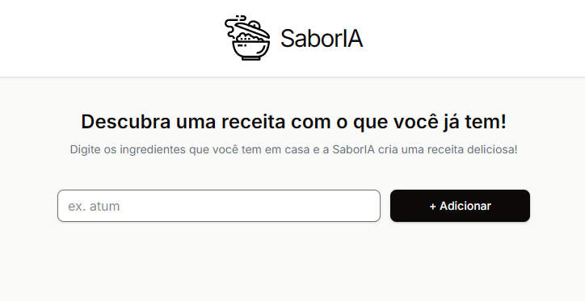
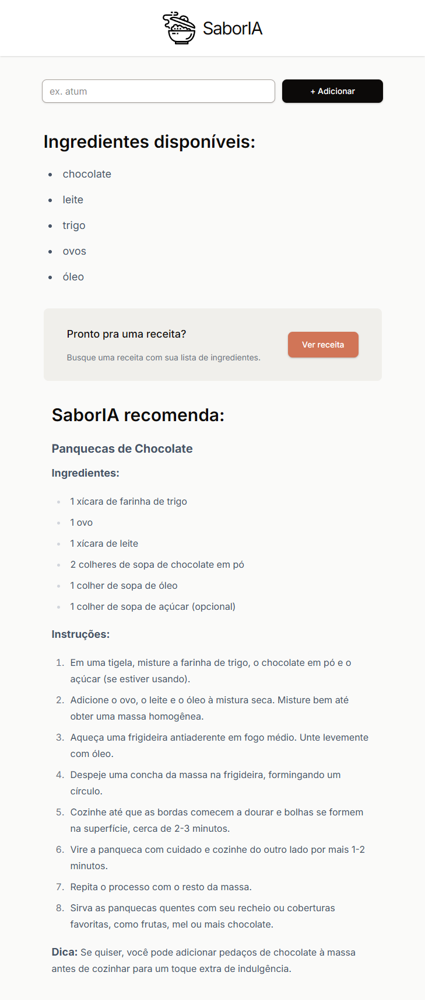

# SaborIA 🍳🤖

## 🔍 Sobre
Um assistente inteligente para criação de receitas culinárias, alimentado por IA, que transforma ingredientes que você tem em casa em pratos incríveis!

SaborIA é um app moderno construído com **Next.js**, **React**, e **Tailwind CSS** (v4.1), integrando API de Inteligência Artificial para gerar receitas personalizadas a partir dos ingredientes que você tem em casa.

---

## ⚙️ Tecnologias

- [Next.js (App Router)](https://nextjs.org/)
- [React](https://react.dev/)
- [Tailwind CSS](https://tailwindcss.com/)
- [TypeScript](https://www.typescriptlang.org/)
- [Groq API](https://console.groq.com/) – para geração de texto com IA
---

## 🚀 Deploy

O projeto está hospedado e disponível para uso em:  
[https://saboria.netlify.app](https://saboria.netlify.app)

---

## 📸 Preview

Veja como a SaborIA traz uma experiência intuitiva e elegante para transformar ingredientes em receitas deliciosas.

<div align="center">





</div>

---

## 🎯 Funcionalidades

- Entrada simples de ingredientes  
- Geração dinâmica e inteligente de receitas  
- Layout responsivo  
- Estilização elegante com Tailwind e plugin Typography  

---


## 🎨 Design no Figma

O layout deste projeto foi inspirado neste modelo do Figma:

🔗 [Modelo no Figma](https://www.figma.com/design/73iyU720zWmrWgJsok5tYE/Chef-Claude?node-id=0-1&p=f&t=PEKl1YVeICuJDXBX-0)

---

## 🛠️ Como rodar localmente

1. Clone o repositório  

    ```bash
    git clone https://github.com/diegocarmn/saboria.git
    cd saboria
2. Instale as dependências

    ```bash
    npm install
3. Configure suas variáveis de ambiente (exemplo .env.local)
    ```bash
    NEXT_PUBLIC_API_KEY=sua_chave_aqui
4. Rode o servidor de desenvolvimento
    ```bash
    npm run dev
5. Abra http://localhost:3000 para ver o app no navegador.

---

## 📄 Licença


Veja o arquivo [LICENSE](./LICENSE) para mais detalhes.

---

✨ Desenvolvido com 💜 por Diego Carmona